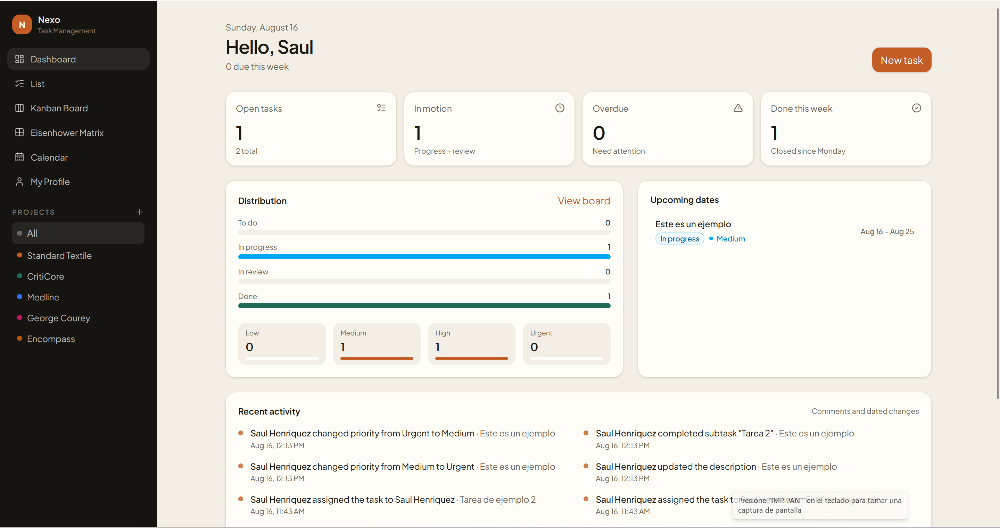
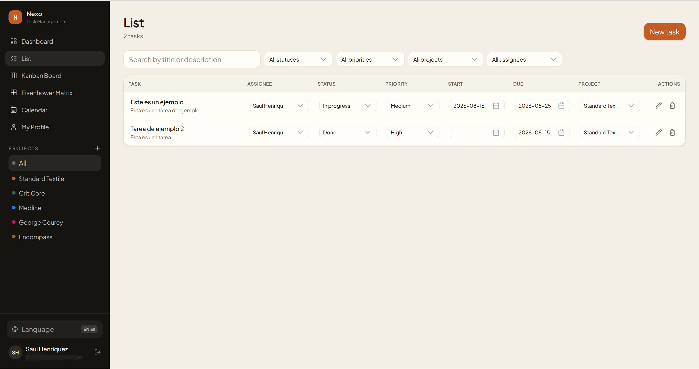
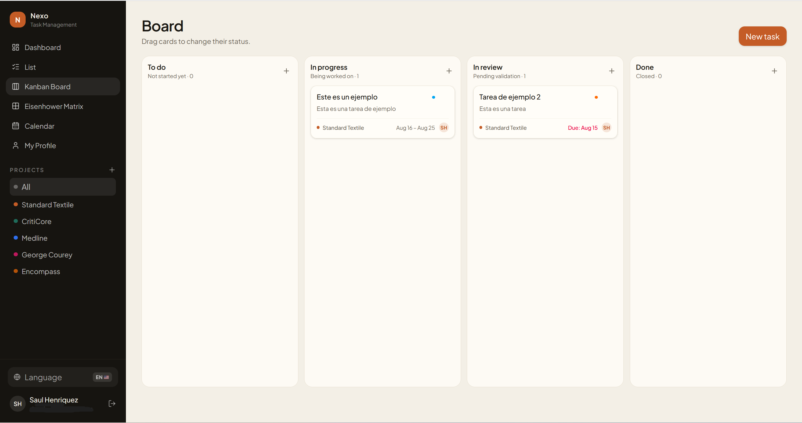
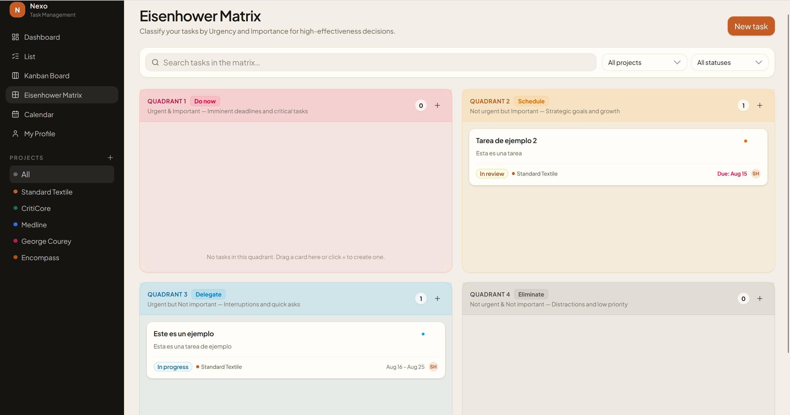
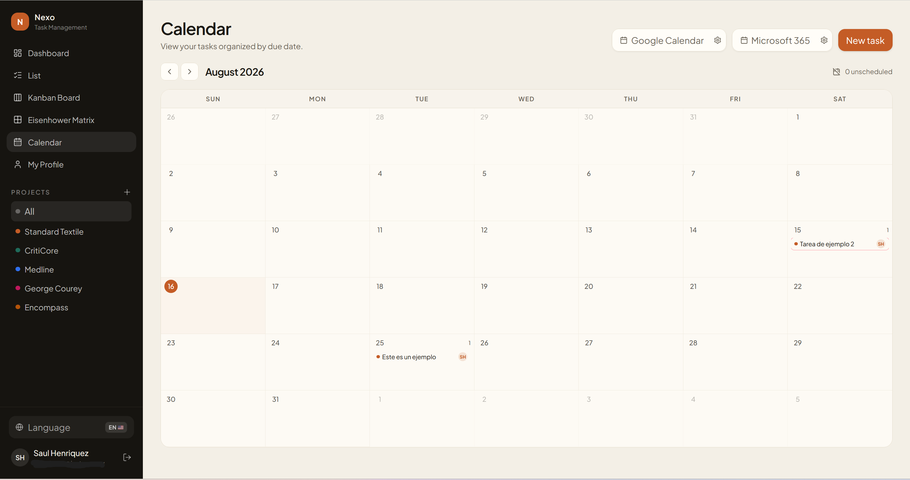
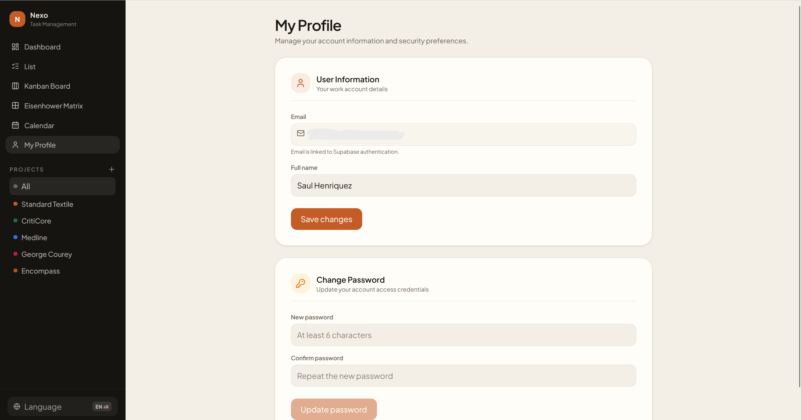

# Nexo

App de gestión de tareas inspirada en Asana, ClickUp y Monday.com. Incluye dashboard, lista, tablero kanban y un detalle con comentarios y bitácora de actividad.

## Cómo arrancar

```bash
npm install
npm run dev
```

Abre [http://127.0.0.1:5173](http://127.0.0.1:5173). En modo local ya hay proyectos y tareas de ejemplo.

## Conectar Supabase

1. Crea un proyecto en [supabase.com](https://supabase.com).
2. En **SQL Editor**, ejecuta `supabase/migrations/20260815120000_init.sql`.
3. Copia `.env.example` a `.env` y rellena:

```env
VITE_SUPABASE_URL=https://xxxx.supabase.co
VITE_SUPABASE_ANON_KEY=eyJ...
```

4. En **Authentication → Providers** deja el correo habilitado. Si no quieres confirmar email en desarrollo, desactiva *Confirm email*.
5. Reinicia `npm run dev`.

Cada usuario nuevo recibe un perfil y un proyecto **General**. Las políticas RLS limitan proyectos, tareas, comentarios y actividad al dueño.

## Qué incluye el MVP

- **Dashboard:** abiertas, en movimiento, vencidas, hechas esta semana, distribución y actividad reciente.
- **Lista:** búsqueda, filtros, alta y edición.
- **Tablero:** columnas Por hacer / En progreso / En revisión / Hecho, con arrastre.
- **Detalle:** descripción, estado, prioridad, fecha, proyecto, comentarios y timeline con fecha.
- **Proyectos:** agrupación tipo espacio de trabajo.

## Capturas de Pantalla (Screenshots)

### Dashboard


### Vista de Lista


### Tablero Kanban


### Matriz de Eisenhower / Prioridades


### Vista de Calendario


### Nueva Tarea


### Perfil de Usuario


### Proyectos

